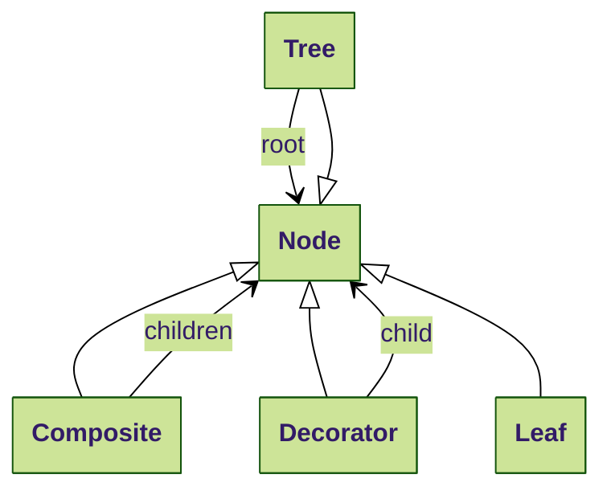
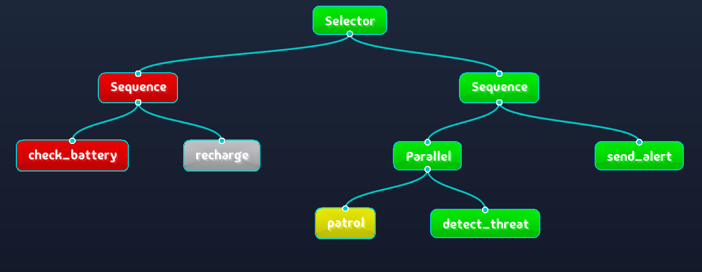
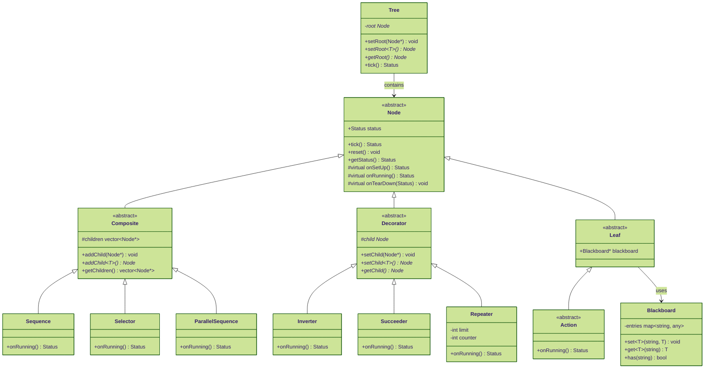

# Behavior Tree (BT)

A lightweight **behavior trees** C++14 library with a real-time visualizer of the state of the tree.

### License

MIT License

### What is a Behavior Tree?

A Behavior Tree is a mathematical model of plan execution used in computer science, robotics, control systems and video games. It describes switching between a finite set of tasks in a modular fashion. Its strength lies in its ability to create very complex tasks composed of simple tasks, without worrying how the simple tasks are implemented.

### Key Features of this library

This project is based on the unmaintained library https://github.com/arvidsson/BrainTree. This library aims to provide a simpler and more intuitive code base compared to the mainstream https://github.com/BehaviorTree/BehaviorTree.CPP library and offers a free real-time visualizer of the tree state.

- Regular nodes:
  - Composites: Sequence, Selector, Parallel
  - Decorators: Inverter, Succeeder, Repeater
  - Leaves: Condition, Action with Blackboard for data sharing
- YAML format as tree description for building trees.
- Export trees to other formats (mermaid, groot2).
- Real-time graphical debugger.

---

## Installation Guide

### Dependencies

- yaml-cpp

```bash
sudo apt-get install libyaml-cpp-dev
```

### Build and Install

```bash
git clone https://github.com/Lecrapouille/BehaviorTree --recurse
cd BehaviorTree
make -j8
sudo make install
```

### Run a demo with the graphical debugger

The `make` command, if successful, should have created a build folder.

```bash
./build/BehaviorTreeViewer &
./build/SecurityRobot
```

### Build and Run Unit Tests

```bash
make test
./tests/TestBehaviorTree
```

A coverage report should appear.

---

## Quick Behavior Tree Start Guide

### Behavior Tree hierarchy

- **Tree**: A hierarchical parent-children structure of nodes. The root is the initial node.
- **Nodes**: The basic building blocks of a behavior tree. Nodes are of three types:
  composite, decorator, and leaf.
- **Composite**: A node that has several children (at least one child).
- **Decorator**: A node that has exactly one child and modifies its status (decoration).
- **Leaf**: Nodes that don't have any children; these are the actual actions that interact with the system (i.e., robot commands).

Here is the UML hierarchy:



### Sharing data between nodes

- **Blackboard**: Since node instances do not know each other and may want to exchange data, they use a shared key/value structure for exchanging data.

### Status and Execution Cycle

The Tree execution engine is single-threaded. Nodes are executed in discrete time concurrently by their tick callback.

- **Concurrency**: When two or more tasks can start, run, and complete in overlapping time periods. It doesn't necessarily mean they will ever both be running at the same instant. **Parallelism** is when tasks run at the same time in different threads, e.g., on a multicore processor.

- **Tick**: The fundamental execution mechanism in behavior trees:
  - A tick is a propagation of execution signals from parent to children.
  - Each tick represents one update cycle of the behavior tree.
  - Ticks flow down the tree from the root to the leaves following specific rules for each node type.
  - When a node is ticked, it executes its logic and returns a status (SUCCESS, FAILURE, or RUNNING).
  - Ticks occur at a frequency determined by the application (e.g., 10Hz for a robot, 60Hz for a game).
  - The `tick()` function implements a template method pattern with hooks for `onSetUp()`, `onRunning()` and `onTearDown()`.
  - The tick methods are sequential and blocking. They are not executed inside a thread.
  - A node should return as soon as possible to avoid blocking the entire flow of execution. Therefore, avoid using loops or delays inside these methods.

- **Node Status**: Each node returns one of three possible statuses:
  - **SUCCESS** (green): The task was completed successfully.
  - **FAILURE** (red): The task could not be completed or a condition was not met.
  - **RUNNING** (orange): The task is still in progress and needs more time to complete.

- **Execution Flow**:
  1. When a parent node is ticked, it decides which children to tick based on its type.
  2. A node calls `onSetUp()` on the first execution. This allows for initialization that can either succeed (SUCCESS) or fail (FAILURE).
  3. A node calls `onRunning()` on subsequent ticks, returning SUCCESS, FAILURE, or RUNNING.
  4. When a node transitions from RUNNING to SUCCESS/FAILURE, `onTearDown()` is called. This allows for cleanup operations.
  5. Different node types (Composite, Decorator, Leaf) implement different strategies for propagating ticks.

### Simple Example

Let's consider a robot with the following minimal tree that allows it to cross a room. The tree is composed of the following nodes:

- Root node depicted by the black dot.
- A single composite node named "Sequence".
- Three leaves depicting three actions the robot can perform:
  - opening a door,
  - walking through the doorway,
  - and closing the door.


The `Sequence` node is a classic composite node executing children in order until one fails.

In our case, the three actions "open door", "walk" and "close door" are executed in this order and immediately return the status SUCCESS. While not all of these three actions have ended, the status of the sequence node is RUNNING. If one of the actions fails (FAILURE), the status of sequence node becomes FAILURE. If all actions end with SUCCESS, the status of sequence node becomes SUCCESS.

In a real situation, each `tick()`'ed actions of the robot would not immediately return SUCCESS or FAILURE but will last several seconds or minutes to be achieved. Each action shall not take too much time to not block the tree `tick()` to make reactive the robot by allowing the execution of other nodes.

### More Documentation on Behavior Tree

- https://roboticseabass.com/2021/05/08/introduction-to-behavior-trees/
- https://lisyarus.github.io/blog/posts/behavior-trees.html

---

## Root

The root can be any type of node.

**Use Case Syntax:**

```yaml
behavior_tree:
  Sequence:      # Root node type
    children:
      - Action:
          name: CheckBattery
      - Action:
          name: PatrolArea
```

## Composite Nodes

Composite nodes are control flow nodes that have one or more children. They determine the order and conditions under which their children are executed.

In YAML, you should add `children:` and attach at least one child.

### Sequence

Can be remembered as `DoInOrder` since it executes children in order until one fails.

**Behavior:**

- Ticks each child node in order.
- Returns SUCCESS if all children succeed.
- Returns FAILURE if any child fails.
- Returns RUNNING if any child is running.

**Use Case Syntax:**

```yaml
- Sequence:
    children:
      - Action:
          name: "OpenDoor"
      - Action:
          name: "Walk"
      - Action:
          name: "CloseDoor"
```

Perfect for tasks that must be completed in sequence, like:

1. Open the door.
2. Walk into the room.
3. Close the door.

**Beware:**

If the action Walk fails, the door will remain open since the last action CloseDoor is skipped.

### Parallel Sequence

Executes all children simultaneously. It comes in two forms: `Parallel` and `ParallelAll`.

**Behavior:**

- **Parallel:**
  - Ticks all children simultaneously.
  - Returns SUCCESS if at least M children succeed (M is configurable, default is 1).
  - Returns FAILURE if more than N-M children fail (N is the total number of children).
  - Returns RUNNING otherwise.

- **ParallelAll:**
  - Ticks all children simultaneously.
  - Returns SUCCESS only if ALL children succeed.
  - Returns FAILURE if ANY child fails.
  - Returns RUNNING otherwise.

**Use Case - Parallel:**

```yaml
- Parallel:
    threshold: 2  # Succeeds when at least 2 children succeed
    children:
      - Action:
          name: "MonitorBattery"
      - Action:
          name: "MonitorObstacles"
      - Action:
          name: "MonitorEnemies"
```

Perfect for scenarios where:
1. You need any one of several conditions to trigger a behavior.
2. You want redundant systems where only some need to succeed.
3. You need to monitor multiple conditions with different priorities.

**Use Case - ParallelAll:**

```yaml
- ParallelAll:
    children:
      - Action:
          name: "MoveForward"
      - Action:
          name: "ScanEnvironment"
      - Action:
          name: "MaintainBalance"
```

Perfect for multitasking where:

1. All tasks must succeed simultaneously.
2. Background processes need to run alongside main tasks.
3. Multiple conditions must all be satisfied.

**Key differences:**

- `Parallel` offers more flexibility with a configurable success threshold.
- `ParallelAll` is more strict, requiring all children to succeed.
- Both execute all children at each tick regardless of individual results.

### Sequence with Memory

Can be remembered as `ContinueInOrder` because it memorizes the point where it stopped.

**Behavior:**

- Similar to Sequence, but it remembers which child it was executing if a child returns RUNNING.
- On the next tick, it will continue from the last running child instead of starting from the beginning.
- Returns SUCCESS if all children succeed.
- Returns FAILURE if any child fails.
- Returns RUNNING if the current child is running.

**Use Case:**

```yaml
- SequenceWithMemory:
    children:
      - Action:
          name: "PrepareTask"
      - Action:
          name: "LongRunningTask"
      - Action:
          name: "CompleteTask"
```

Perfect for:

1. Tasks that continue over multiple ticks.
2. Preserving progress in a sequence.
3. Avoiding redundant execution of already completed steps.

### ReactiveSequence

Can be remembered as `CheckAll` because it checks all previous children at each tick.

**Behavior:**

- Always starts from the first child.
- Re-evaluates all previously successful children at each tick.
- If a previously successful child now fails, the sequence fails.
- Returns SUCCESS if all children succeed.
- Returns FAILURE if any child fails.
- Returns RUNNING if the current child is running.

**Use Case:**

```yaml
- ReactiveSequence:
    children:
      - Condition:
          name: "IsPathClear"
      - Action:
          name: "MoveForward"
```

Perfect for:

1. Conditions that must remain true throughout an action
2. Safety checks that need constant verification
3. Tasks that should stop immediately if prerequisites are no longer met

### Selector

Also known under the name of `Fallback` in the documentation but can be remembered as `TryUntilSuccess` because it executes children in order until one succeeds.

**Behavior:**

- Ticks each child node in order.
- Returns SUCCESS if any child succeeds.
- Returns FAILURE if all children fail.
- Returns RUNNING if any child is running.

**Use Case:**

```yaml
- Selector:
    children:
      - Action:
          name: "FindEnemy"
      - Action:
          name: "PatrolArea"
      - Action:
          name: "ReturnToBase"
```

Ideal for fallback behaviors:

1. Try to find an enemy.
2. If no enemy found, patrol the area.
3. If patrol fails, return to base.

### Fallback with Memory

Can be remembered as `RememberAndTry` because like `TryUntilSuccess` but memorizes the point where it stopped.

**Behavior:**

- Similar to Selector, but it remembers which child it was executing if a child returns RUNNING.
- On the next tick, it will continue from the last running child instead of starting from the beginning.
- Returns SUCCESS if any child succeeds.
- Returns FAILURE if all children fail.
- Returns RUNNING if the current child is running.

**Use Case:**

```yaml
- FallbackWithMemory:
    children:
      - Action:
          name: "TryPrimaryMethod"
      - Action:
          name: "TryBackupMethod"
      - Action:
          name: "EmergencyProtocol"
```

Perfect for:

1. Complex fallback scenarios that span multiple ticks
2. Recovery strategies that need to continue from where they left off
3. Avoiding restarting already attempted recovery steps

### Reactive Fallback

Can be remembered as `CheckUntilSuccess` because it checks for success and tries again at each tick.

**Behavior:**

- Always starts from the first child.
- Re-evaluates previously failed children at each tick.
- If a previously failed child now succeeds, the selector succeeds.
- Returns SUCCESS if any child succeeds.
- Returns FAILURE if all children fail.
- Returns RUNNING if the current child is running.

**Use Case:**

```yaml
- ReactiveFallback:
    children:
      - Condition:
          name: "IsPathA"
      - Condition:
          name: "IsPathB"
      - Action:
          name: "FindAlternativePath"
```

Perfect for:

1. Continuously checking if preferred options become available.
2. Reactive planning that adapts to changing conditions.
3. Implementing priority-based decisions that need constant reassessment.

---

## Decorator Nodes

Decorator nodes have exactly one child and modify its behavior.

In YAML, you should add `child:` and attach exactly one child.

### Inverter

Inverts the result of its child node.

**Behavior:**

- Returns SUCCESS if child returns FAILURE.
- Returns FAILURE if child returns SUCCESS.
- Returns RUNNING if child returns RUNNING.

**Use Case:**

```yaml
- Inverter:
    child:
      - Condition:
          name: "IsEnemyVisible"
```

Useful for:

- Checking if something is NOT true.
- Creating "unless" conditions.
- Inverting sensor readings.

### Succeeder

Always returns SUCCESS.

**Behavior:**

- Returns SUCCESS regardless of child's status.
- Useful for debugging or forcing success.

**Use Case:**

```yaml
- Succeeder:
    child:
      - Action:
          name: "DebugAction"
```

Useful for:

- Debugging behavior trees.
- Temporarily disabling failure conditions.
- Testing tree structure.

### Repeater

Repeats its child node a specified number of times.

**Behavior:**

- Repeats child until it succeeds or reaches the limit.
- Can be configured for infinite repetition.
- Returns SUCCESS when child succeeds or limit is reached.
- Returns RUNNING while repeating.

**Use Case:**

```yaml
- Repeater:
    times: 3
    child:
      - Action:
          name: "TryOpenDoor"
```

Perfect for:

- Retrying failed actions.
- Implementing persistence behaviors.
- Creating loops in behavior trees.

### ForceSuccess

Similar to Succeeder but only transforms failures.

**Behavior:**

- If child returns SUCCESS or RUNNING, returns the same status.
- If child returns FAILURE, returns SUCCESS instead.

**Use Case:**

```yaml
- ForceSuccess:
    child:
      - Action:
          name: "OptionalTask"
```

Useful for:

- Optional tasks that shouldn't cause the whole sequence to fail.
- Ignoring specific failure cases.
- Implementing "try but don't fail" semantics.

### ForceFailure

The opposite of ForceSuccess.

**Behavior:**

- If child returns FAILURE or RUNNING, returns the same status.
- If child returns SUCCESS, returns FAILURE instead.

**Use Case:**

```yaml
- ForceFailure:
    child:
      - Action:
          name: "UndesiredResult"
```

Useful for:

- Testing negative conditions.
- Preventing specific success cases.
- Implementing "succeed only if not" semantics.

### Timeout

Limits the execution time of its child.

**Behavior:**

- Starts a timer when the child begins execution.
- Returns FAILURE if the timeout is reached.
- Otherwise, returns the child's status.

**Use Case:**

```yaml
- Timeout:
    milliseconds: 5000
    child:
      - Action:
          name: "LongRunningTask"
```

Useful for:

- Preventing actions from running too long.
- Time-critical operations.
- Implementing fallback triggers.

## Leaf Nodes

Leaf nodes are the actual behavior nodes that perform actions or check conditions.

### Condition

Evaluates a condition and returns SUCCESS or FAILURE.

**Behavior:**

- Checks a specific condition.
- Returns SUCCESS if the condition is true.
- Returns FAILURE if the condition is false.
- Never returns RUNNING.

**Example:**

```yaml
- Condition:
    name: "IsEnemyVisible"
    parameters:
      range: 100.0
```

Useful for:

- Boolean checks.
- Sensor readings.
- State validation.

### Action

Performs an action and returns a status.

**Behavior:**

- Executes the specified action.
- Returns SUCCESS if action completes successfully.
- Returns FAILURE if action fails.
- Returns RUNNING if action is still executing.

**Example:**

```yaml
- Action:
    name: "MoveToTarget"
    parameters:
      speed: 1.0
      target: [10, 20]
```

### Blackboard

Shares data between nodes.

**Behavior:**

- Stores key-value pairs.
- Accessible by all leaf nodes.
- Thread-safe access.

**Example:**

```cpp
auto blackboard = std::make_shared<bt::Blackboard>();
blackboard->set<int>("battery_level", 100);
blackboard->set<bool>("enemy_detected", false);
```

#### Blackboard Example Use Case

Reading and writing to the blackboard:

```cpp
// Writing to the blackboard
blackboard->set<std::string>("target_location", "kitchen");
blackboard->set<float>("minimum_distance", 1.5f);

// Reading from the blackboard
std::string location = blackboard->get<std::string>("target_location");
float distance = blackboard->getOr<float>("minimum_distance", 1.0f); // with default value
```

### Creating Custom Actions

There are two ways to create custom Action nodes:

1. Inheritance from the `Action` class.
2. Using a lambda function.

#### 1. Inheritance Method

Here is a template for a custom Action node:

```cpp
class MyCustomAction : public bt::Action
{
public:
    MyCustomAction(bt::Blackboard::Ptr blackboard)
        : bt::Action(blackboard)
    {}

    bt::Status onSetUp() override
    {
        std::cout << "MyCustomAction onSetUp" << std::endl;
        // Do initialization here
        return bt::Status::SUCCESS;
    }

    bt::Status onRunning() override
    {
        std::cout << "MyCustomAction onRunning" << std::endl;
        // Implement your action logic here
        return bt::Status::RUNNING;
    }

    void onTearDown(Status status) override
    {
        // Clean up resources here
    }
};
```

#### 2. Lambda Function Method

```cpp
// Register a simple action using a lambda
factory.registerAction("simple_action", []() {
    std::cout << "Executing simple action" << std::endl;
    return Status::SUCCESS;
});

// Register an action with blackboard access
factory.registerAction("blackboard_action", [blackboard]() {
    int value = blackboard->get<int>("my_value");
    std::cout << "Value from blackboard: " << value << std::endl;
    return Status::SUCCESS;
}, blackboard);
```

---

## Example: Security Robot

A complete example of a security robot behavior tree `security_robot.yaml`:

```yaml
behavior_tree:
  type: selector
  children:
    - type: sequence
      children:
        - type: action
          name: "check_battery"
        - type: action
          name: "patrol_area"
```

Let's create a simple behavior tree that makes a robot patrol an area:

```cpp
#include "BehaviorTree/BehaviorTree.hpp"
#include "BehaviorTree/TreeBuilder.hpp"

// Define our custom actions as class
class CheckBattery : public bt::Action
{
public:
    Status onRunning() override
    {
        std::cout << "Checking battery..." << std::endl;
        return Status::SUCCESS;
    }
};

// Define our custom actions as class
class PatrolArea : public bt::Action
{
public:
    explicit PatrolArea(Blackboard::Ptr blackboard)
        : Action(blackboard)
    {}

    Status onRunning() override
    {
        int area_level = m_blackboard->getOr<int>("area_level", 42);
        std::cout << "Patrolling in area " << area_level << " ..." << std::endl;
        return Status::RUNNING;
    }
};

class SecurityRobotFactory : public bt::NodeFactory
{
public:
    SecurityRobotFactory(bt::Blackboard::Ptr blackboard)
    {
        registerNode<CheckBattery>("check_battery", blackboard);
        registerNode<PatrolArea>("patrol_area", blackboard);
    }
};

int main()
{
    auto blackboard = std::make_shared<bt::Blackboard>();
    blackboard->set<int>("area_level", 42);

    auto factory = std::make_shared<SecurityRobotFactory>(blackboard);
    bt::TreeBuilder builder(factory);

    auto tree = builder.fromYAML("security_robot.yaml");
    assert(tree != nullptr);

    while (true)
    {
        tree->tick();
        std::this_thread::sleep_for(std::chrono::seconds(1));
    }

    return 0;
}
```

### Using the Graphical Debugger

The graphical debugger helps visualize and debug your behavior trees in real-time.

1. Start the visualizer server:

```bash
./build/BehaviorTreeViewer --port 9090
```

The application is empty and is waiting for a client to connect on the given port.

2. Add visualization to your application:

```cpp
#include "BehaviorTree/BehaviorTreeVisualizer.hpp"

// Attach tree to visualizer client
BehaviorTreeVisualizer visualizer(*tree, "127.0.0.1", 9090);

// Optional: Wait for connection
while (!visualizer.isConnected())
{
    std::this_thread::sleep_for(std::chrono::seconds(1));
}

while (true)
{
    visualizer.updateDebugInfo();
    tree->tick();
    std::this_thread::sleep_for(std::chrono::seconds(1));
}
```

You should see a real-time visualization of your behavior tree execution, showing the status of each node with color coding (green for SUCCESS, red for FAILURE, and orange for RUNNING).



---

## Behavior Tree API

The behavior tree is built using a clear class hierarchy that defines the structure and behavior of different node types:

