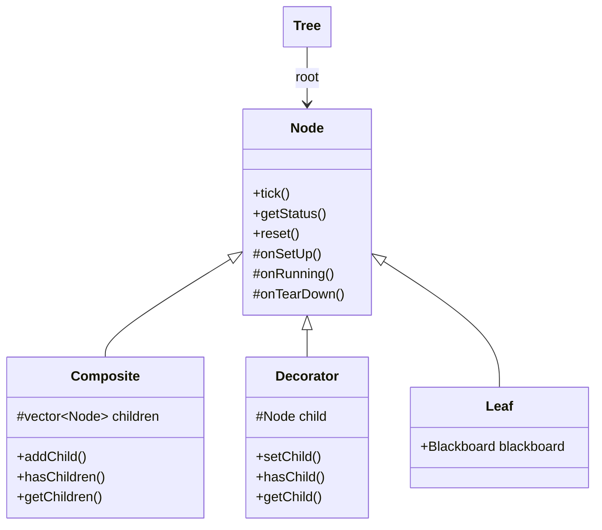

# Behavior Tree

## Description

My own **behavior trees** C++14 library based on the unmaintained library https://github.com/arvidsson/BrainTree but nicely written (600 lines of code). I wanted to add some missing features such as a graphical debugger, a more powerful blackboard, complete missing nodes.

For my work, I had to use the mainstream library https://github.com/BehaviorTree/BehaviorTree.CPP (BT_CPP) but I never liked it because of the several critical reasons in my taste: the installation is complex (conan), the versioning is not intuitive (groot compatibility), the documentation is not well written (missing the description of existing nodes), the code source is complex (compared to elegancy of BrainTree), the tree description in the XML format is splitted (making complex to parse), the graphical debugger is no longer open source and I found not very intuitive (choose of terms such "instance name" vs. "model name").

My library is trying to complete BrainTree by offering the following features:
- Basic nodes:
  - Composites: Sequence, Selector, Parallel.
  - Decorators: Inverter, Succeeder, Repeater.
  - Leaves: Actions and Blackboard to share data between nodes.
  - **WIP: completing missing nodes to follow the BT_CPP standard.**
- Use the YAML format to describe trees.
- Export trees to other format (i.e. mermaid, groot2 file format).
- Real-time graphical debugger to visualize running trees.

## Build and install

### Dependencies

**TODO: remove libyaml-cpp-dev dependency.**

- yaml-cpp

```bash
sudo apt-get install libyaml-cpp-dev
```

### Build and install

```bash
git clone https://github.com/Lecrapouille/BehaviorTree --recurse
cd BehaviorTree
make -j8

# Run a demo with the graphical debugger
./build/BehaviorTreeViewer &
./build/SecurityRobot

# Install
sudo make install
```

### Build and run unit tests

```bash
make test
./tests/TestBehaviorTree
```

## Demos

Find demos inside the [demos/](demos/) folder.

## Usages

### Header, namespace and linkage

To use the library, you need to include the following header:

```cpp
#include <BehaviorTree/BehaviorTree.hpp>
```

and use the following namespace:

```cpp
namespace bt
```

and link your application against `libbehavior_tree.so` or `libbehavior_tree.a`.
Use the pkg-config tool (add `--static` to link statically):

```bash
pkg-config --cflags --libs behavior_tree
```

### Basic C++ example

```cpp
#include <BehaviorTree/BehaviorTree.hpp>

bt::Tree tree;
tree.setRoot<Sequence>();
tree.addChild<LeafSuccess>();

// Status: RUNNING, SUCCESS or FAILURE
bt::Status status = tree.tick();
```

### Custom Action nodes

There are two ways to create custom Action nodes:
- Inheritance from the `Action` class.
- Using a lambda function.

#### Inheritance from the `Action` class

Here is the template of a custom Action node that inherits from the `Action` class:

```cpp
class MyCustomAction : public bt::Action
{
public:

    MyCustomAction(bt::Blackboard::Ptr blackboard)
        : bt::Action(blackboard)
    {}

    bt::Status onSetUp() override
    {
        std::cout << "MyCustomAction onSetUp" << std::endl;

        bool condition = /* do some start up stuff */;
        if (/* condition == nominal condition */)
        {
            std::cout << "MyCustomAction onSetUp: ends nominally" << std::endl;
            return bt::Status::SUCCESS; // or RUNNING
        }
        else
        {
            std::cerr << "MyCustomAction onSetUp: ends with failure" << std::endl;
            return bt::Status::FAILURE;
        } 
    }

    bt::Status onRunning() override
    {
        std::cout << "MyCustomAction onRunning" << std::endl;

        bool condition = /* do some stuff */;
        if (/* condition == nominal condition */)
        {
            std::cout << "MyCustomAction onRunning: ends nominally" << std::endl;
            return bt::Status::SUCCESS;
        }
        else
        {
            std::cerr << "MyCustomAction onRunning: ends with failure" << std::endl;
            return bt::Status::FAILURE;
        }

        // Long action ...
        return bt::Status::RUNNING;
    }
    
    void onTearDown(Status status) override
    {
        if (status == bt::Status::SUCCESS)
        {
            // MyCustomAction onRunning() has ended nominally
        }
        else // status == bt::Status::FAILURE
        {
            // MyCustomAction onRunning() has ended with failure
        }
    }
};
```

Notes:
- Use the constructor with `Blackboard` only if you need to access the blackboard. Else, do not add constructor.
- Methods `.onSetUp()` is optional. Add it to do some stuff at the beginning of the node. Return SUCCESS or RUNNING when the setup action ends successfully. Return FAILURE otherwise.
- Method `.onTearDown(Status status)` is optional. Add it to clean up resources or do some stuff at the end of the node. The parameter is the status of the node when it has ended (SUCCESS or FAILURE).
- Method `.onRunning()` is mandatory. Add the logic of the action in this method. Return SUCCESS when the action ends successfully, FAILURE if it fails, RUNNING if it is still running.

#### Using a lambda function

```cpp
TODO
```

### Usage with file tree description

Let suppose the following behavior tree is defined in a YAML file `tree.yaml`:

```yaml
behavior_tree:
  type: sequence
  children:
    - type: action
      name: patrol
    - type: action
      name: detect_threat
    - type: action
      name: send_alert
```

Here a minimal example of how to load andrun the tree:

```cpp
#include <BehaviorTree/BehaviorTree.hpp>

// Action class using a blackboard
class DetectThreat : public Action
{
public:
    explicit DetectThreat(Blackboard::Ptr blackboard)
        : Action(blackboard)
    {}

    Status onRunning() override
    {
        bool threat = m_blackboard->getOr<bool>("threat_detected", false);
        std::cout << "Scanning for threats...\n";
        return threat ? Status::SUCCESS : Status::FAILURE;
    }
};

// Action class not using a blackboard
class SendAlert : public Action
{
public:
    Status onRunning() override
    {
        std::cout << "ALERT\n";
        return Status::SUCCESS;
    }
};

// Factory to register our actions
class SecurityRobotFactory : public bt::NodeFactory
{
public:
    SecurityRobotFactory(bt::Blackboard::Ptr blackboard)
    {
        registerNode<DetectThreat>("detect_threat", blackboard);

        registerNode<SendAlert>("send_alert");

        // Compact form for an Action (without a class)
        registerAction("patrol", [blackboard]() {
            std::cout << "Patrolling area" << std::endl;
            return Status::RUNNING;
        }, blackboard);
    }
};

int main()
{
    // Create a blackboard
    auto blackboard = std::make_shared<bt::Blackboard>();
    blackboard->set<bool>("threat_detected", false);

    // Create a factory
    bt::TreeBuilder builder;
    builder.setFactory<SecurityRobotFactory>(blackboard);

    // Create a tree from a YAML file
    bt::Tree::Ptr tree;
    try
    {
        tree = builder.fromYAML("tree.yaml");
    }
    catch (const std::exception& e)
    {
        std::cerr << "Error: " << e.what() << std::endl;
        return EXIT_FAILURE;
    }

    // Run the tree
    while (true)
    {
        tree->tick();
        std::this_thread::sleep_for(std::chrono::seconds(1));
    }
    return EXIT_SUCCESS;
}
```

### Usage with the graphical debugger

The library provides a graphical debugger to visualize the behavior tree.
Start the visualizer server before running the application:

```bash
./build/BehaviorTreeViewer --port 9090
```

The server is listening on port 9090.

Add the following line to the C++ application running the tree:

```cpp
#include "BehaviorTree/BehaviorTreeVisualizer.hpp"

...
    // Attach the desired tree to the visualizer client.
    // Connection to the server.
    BehaviorTreeVisualizer visualizer(*tree, "127.0.0.1", 9090);

    // Wait for the visualizer client to connect
    while (!visualizer.isConnected())
    {
        std::this_thread::sleep_for(std::chrono::seconds(1));
    }

    while (true)
    {
        visualizer.updateDebugInfo(); 
        tree->tick();
        std::this_thread::sleep_for(std::chrono::seconds(1));
    }
```

## Guide of nodes

### Inheritance

The behavior tree is composed of different types of nodes:



- **Tree**: It contains the root node.

- **Node**: The base class for all nodes. It defines the core behavior tree functionality with methods like `.getStatus()` returning the current status of the node (RUNNING, SUCCESS, or FAILURE), `.tick()` to execute the node which will call one of the virtual method `.onSetUp()` if the node is not running, then `.onRunning()` and finally `.onTearDown()` if the node is not running.

- **Composite**: Base class for nodes that can have multiple children with methods `.addChild()` and `.getChildren()`, `.hasChildren()`. These nodes control the flow of the behavior tree by defining how and when to execute their children. 

- **Decorator**: Base class for nodes that have exactly one child with methods `.setChild()` and `.getChild()`, `.hasChild()`. These nodes modify the behavior of their uniquechild node. 

- **Leaf**: Base class for nodes that have no children. These are the nodes that actually perform actions or check conditions. They can access a blackboard to share data between nodes.

- **Blackboard**: is a key/value storage shared object that can be accessed by all leaves. It is used to share data between nodes. A blackboard entry is a key/value pair. The key is defined by the type of the value and a string name. The value can be of any C++ type.

### Tree execution engine

- **Concurrency**: is when two or more tasks can start, run, and complete in overlapping time periods. It doesn't necessarily mean they'll ever both be running at the same instant.

- **Parallelism**: is when tasks run at the same time in different threads, e.g., on a multicore processor.

The tree execution engine is single-threaded. 


All the `.tick()` methods are executed sequentially. If any `.tick()` method is blocking, the entire flow of execution will be blocked. An Action that takes a long time to execute should return as soon as possible the state RUNNING.

### Composites

Selector: Executes children in order until one succeeds.
Sequence: Executes children in order until one fails.
ParallelSequence: Executes all children simultaneously

| Composite        | Behaviour                                                                       | Success                 | Running               | Failure              |
| ---------------- | ------------------------------------------------------------------------------- | ----------------------- | --------------------- | -------------------- |
| Selector         | Ticks each child node in order until one succeeds, starting from the beginning each tick           | If a child succeeds     | If a child is running | If all children fail |
| Sequence         | Ticks each child node in order until one fails, starting from the beginning each tick           | If all children succeed | If a child is running | If a child fails     |
| StatefulSelector | Ticks each child node in order until one succeeds, starting from the child ticked in previous tick | If a child succeeds     | If a child is running | If all children fail |
| StatefulSequence | Ticks each child node in order until one fails, starting from the child ticked in previous tick | If all children succeed | If a child is running | If a child fails     |
| ParallelSequence | Ticks all children simultaneously | If all children succeed | If a child is running | If a child fails     |

### Decorators

| Decorator    | Behaviour                                                 |
| ------------ | --------------------------------------------------------- |
| Succeeder    | Always returns SUCCESS                                    |
| Failer       | Always returns FAILURE                                    |
| Inverter     | Inverts the result of the child node                      |
| Repeater     | Repeats until child node succeeds (infinitely or limited) |
| UntilSuccess | Repeats until child node succeeds                         |
| UntilFailure | Repeats until child node fails                            |

### Leaves

| Leaf         | Behaviour                                                 |
| ------------ | --------------------------------------------------------- |
| Success      | Always returns SUCCESS                                    |
| Failure      | Always returns FAILURE                                    |
| Action       | Perform actions by overriding the `onRunning()` method    |

### Roseta stone of node names with BT_CPP

Our library | BT_CPP | Types
--- | --- | ---
AlwaysSuccess | AlwaysSuccess | Leaf
AlwaysFailure | AlwaysFailure | Leaf
Action | Action | Leaf

Our library | BT_CPP | Types
Sequence | Sequence | Composite
ParallelSequence | ParallelAll, Parallel | Composite
StatefulSequence | SequenceWithMemory | Composite
? | ReactiveSequence | Composite
Selector | Fallback | Composite
StatefulSelector | ReactiveFallback | Composite

Our library | BT_CPP | Types
Inverter | InvertNode | Decorator
Succeeder | SucceederNode | Decorator
Failer | FailerNode | Decorator
Repeater | RepeaterNode | Decorator
UntilSuccess | UntilSuccessNode | Decorator
UntilFailure | UntilFailureNode | Decorator


Examples include:
  - Inverter: Inverts the result of its child. Tick the child once and return SUCCESS if the child failed or FAILURE if the child succeeded. If the child returns RUNNING, this node returns RUNNING too.
  - Succeeder: Always returns SUCCESS.
  - Repeater: Repeats its child a specified number of times.
  - UntilSuccess/UntilFailure: Repeats child until it succeeds/fails.


## Roseta stone of node names with BT_CPP

Our library | BT_CPP | Types
--- | --- | ---
Success | AlwaysSuccess | Leaf
Failure | AlwaysFailure | Leaf
Action | ActionNode | Leaf


Selector | SelectorNode | Composite
Sequence | SequenceNode | Composite
ParallelSequence | ParallelNode | Composite

Inverter | InvertNode | Decorator
Succeeder | SucceederNode | Decorator
Failer | FailerNode | Decorator
Repeater | RepeaterNode | Decorator
UntilSuccess | UntilSuccessNode | Decorator
UntilFailure | UntilFailureNode | Decorator

## YAML syntax

### Leaf Nodes 

#### Action

Represents an action to execute.

```yaml
- Action:
    name: "AttackEnemy"
    parameters:
      target: "Enemy1"
      damage: 10
```

#### Condition

Represents a condition to check.

```yaml
- Condition:
    name: "IsEnemyVisible"
    parameters:
      range: 100.0
```

### Composite Nodes

#### Sequence

Executes its children in sequence. Fails if any child fails.

```yaml
- Sequence:
    children:
      - child1: ...
      - child2: ...
      - ...
```

#### Parallel

Executes multiple children in parallel.

```yaml
- Parallel:
    success_on_all: true
    fail_on_all: false
    children:
      - child1: ...
      - child2: ...
      - ...
```

Cette classe utilise une politique de succès/échec basée sur des booléens. Elle est plus simple à utiliser quand on veut que tous les nœuds enfants (ou au moins un) réussissent ou échouent.

```yaml
- Parallel:
    success_threshold: 2
    failure_threshold: 1
    children:
      - child1: ...
      - child2: ...
      - ...
```

Cette classe prend en paramètre un nombre minimum de succès et d'échecs requis. Elle est plus flexible car elle permet de spécifier exactement combien de nœuds enfants doivent réussir ou échouer.

#### Selector

Executes its children until one succeeds.

```yaml
- Selector:
    children:
      - child1: ...
      - child2: ...
      - ...
```

## Decorator Nodes

### Repeat

Repeats a child node a specified number of times or indefinitely.

```yaml
- Repeat:
    times: 3  # Optional, omit for infinite repetition
    child:
      - Action:
          name: "MoveForward"
```

### RepeatUntilSuccess

Repeats a child node until it succeeds.

```yaml
- RepeatUntilSuccess:
    child:
      - Action:
          name: "FindEnemy"
```

### Inverter

Inverts the result of the child node (success ↔ failure).

```yaml
- Inverter:
    child:
      - Condition:
          name: "IsEnemyVisible"
```

### Retry

Retries a child node a specified number of times if it fails.

```yaml
- Retry:
    attempts: 5  # Number of retries
    child:
      - Action:
          name: "OpenDoor"
```

### Timeout

Limits the execution time of a child node.

```yaml
- Timeout:
    duration: 5.0  # Duration in seconds
    child:
      - Action:
          name: "SearchForItem"
```

## Special Nodes

### SubTree

Reuses a subtree defined elsewhere.

```yaml
- SubTree:
    tree_id: "PatrolBehavior"
```

### BlackboardCheck

Checks a value in the Blackboard.

```yaml
- BlackboardCheck:
    key: "HasAmmo"
    value: true
    child:
      - Action:
          name: "Shoot"
```

### Example

```yaml
behavior_tree:
  root: Selector
  children:
    - Sequence:
        children:
          - Condition:
              name: "IsEnemyVisible"
          - Retry:
              attempts: 3
              child:
                - Action:
                    name: "AttackEnemy"
    - Sequence:
        children:
          - Condition:
              name: "IsAtPatrolPoint"
          - Repeat:
              times: 2
              child:
                - Action:
                    name: "MoveToNextPatrolPoint"
    - Inverter:
        child:
          - Condition:
              name: "IsLowHealth"
    - Action:
        name: "Idle"
```

## License

MIT License