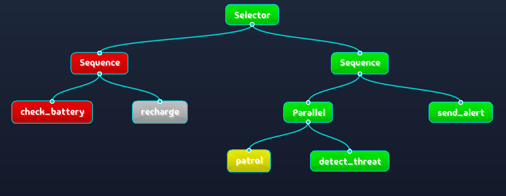
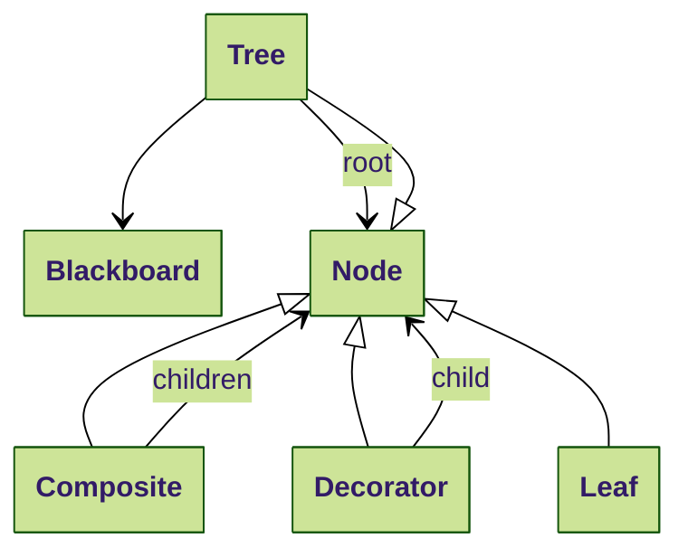

# 🌳 Behavior Tree (BT)

A lightweight **behavior trees** C++14 library with a real-time visualizer application.

**⚠️ Warning: This library is still on its early stage. Use it with caution !**

This library is based on [BrainTree](https://github.com/arvidsson/BrainTree), which is no longer maintained.
It offers a simpler codebase than [BehaviorTree.CPP](https://github.com/BehaviorTree/BehaviorTree.CPP).
Unlike BehaviorTree.CPP, our tree visualizer remains free and open source (and not compatible to Groot).

BrainTree comes with the following nodes:

- Composites: Sequence, Selector, Parallel.
- Decorators: Inverter, Succeeder, Repeater.
- Leaves: Action with Blackboard for data sharing.

This library BrainTree extends by implementing the following features:

- New nodes:
  - Composites: Reactive and with-memory sequence and selector.
  - Decorators: .
  - Leaves: Condition.
- YAML format as tree description for building trees.
- Export trees to other formats (mermaid, groot2).
- Real-time graphical debugger.

---

## 🏗️ Building this project

### 📦 Dependencies

- yaml-cpp: for building trees.
- [SFML](https://www.sfml-dev.org/fr/): for visualizing trees.

```bash
sudo apt-get install libyaml-cpp-dev libsfml-dev
```

### 🛠️ Compilation and Installation

```bash
git clone https://github.com/Lecrapouille/BehaviorTree --recurse
cd BehaviorTree
make -j8
make viewer -j8
make demos -j8
```

You can optionally install on your operating system:

```bash
sudo make install
```

You can optionally run unit-tests:

```bash
make test -j8
./tests/TestBehaviorTree
```

A coverage report should appear.

### 👀 Run the Behavior Tree Visualizer Application

This library also comes with a standalone application that listens on port 9090 (by default) and
visualizes the running Behavior Tree connected to it.

Launch this application before running the target application to enable visualization:

```bash
./build/BehaviorTreeVisualizer
```

Here is an example of what you can see once a tree is discovered:



### 🎮 Run a Demo

The `make` command, if successful, should have created a `build` folder at the root of the project.
This demo is ready to connect to the visualizer.

```bash
./build/demos/SecurityRobot
```

---

## 🌲 What are Behavior Trees?

A Behavior Tree is a mathematical model of plan execution used in computer science, robotics, control systems and video games. Behavior Trees are used as an alternative to state machines. A Behavior Tree describes switching between a finite set of tasks in a modular fashion. Its strength lies in its ability to create very complex tasks composed of simple tasks, without worrying how the simple tasks are implemented.

### 📊 Hierarchy of Node Types

- **Tree**: A hierarchical parent-children structure of nodes. The root is the initial node.
- **Nodes**: The basic building blocks of a behavior tree. Nodes are of three types:
  composite, decorator, and leaf.
- **Composite**: A node that has several children (at least one child).
- **Decorator**: A node that has exactly one child and modifies its status (decoration).
- **Leaf**: Nodes that don't have any children; these are the actual actions that interact with the system (i.e., robot commands).
- **Blackboard**: Since node instances do not know each other and may want to exchange data, they use a shared key/value structure (dictionary) for exchanging data.



### ⚡ Execution Cycle

The execution engine for a tree is single-threaded. Nodes are executed in discrete time concurrently by their **tick** callback. First, let remember the two important definitions:

- **Concurrency**: When two or more tasks can start, run, and complete in overlapping time periods. It doesn't necessarily mean they will ever both be running at the same instant.
- **Parallelism** is when tasks run at the same time in different threads, e.g., on a multi-core processor.

**Tick**: is the fundamental execution mechanism in behavior trees:

- Each tick represents one update cycle of the behavior tree. Ticks occur at a frequency determined by the application (e.g., 10Hz for a robot, 60Hz for a game).
- A tick is a propagation of execution signals from parent to children. It flows down the tree from the root to the leaves following specific rules for each node type. When a parent node is ticked, it decides which children to tick based on its type.
- When a node is ticked, it executes its logic and returns a **status** (SUCCESS, FAILURE, RUNNING). Since the logic is not executed inside a thread, the execution should return as soon as possible to avoid blocking the entire flow of execution of the tree.

**Status**:
  - **SUCCESS** (green): The task was completed successfully.
  - **FAILURE** (red): The task could not be completed or a condition was not met.
  - **RUNNING** (orange): The task is still in progress and needs more time to complete.

**Execution Flow**: The `tick()` function implements a template method pattern with hooks for `onSetUp()`, `onRunning()` and `onTearDown()`.

- A node calls `onSetUp()` on the first execution. This allows for initialization that can either succeed (SUCCESS) or fail (FAILURE).
- A node calls `onRunning()` on subsequent ticks, returning SUCCESS, FAILURE, or RUNNING.
- When a node transitions from RUNNING to SUCCESS/FAILURE, `onTearDown()` is called. This allows for cleanup operations.
- Different node types (Composite, Decorator, Leaf) implement different strategies for propagating ticks, as explained in details in next sections of this document.

### 📝 Simple Example

Let's consider a robot with the following minimal tree that allows it to cross a room.


The tree is composed of the following nodes:

- Root node depicted by the black dot.
- A single composite node named `Sequence` which is a composite node executing children in order until one fails. This node is given in all behavior tree libraries.
- For our example, three project-specific leaves depicting three actions the robot can perform:
  - opening a door,
  - walking through the doorway,
  - and closing the door.

Thanks to the `Sequence` node, the three actions `open the door`, `walk` and `close the door` are executed in this order and, in our case, immediately return the status `SUCCESS`. While three actions have not all ended with `SUCCESS` the status of the `Sequence` node stays to `RUNNING`. If one of the actions fails (return `FAILURE`), the status of the sequence node becomes `FAILURE` and stop executing children nodes. If all actions end with `SUCCESS`, the status of sequence node becomes `SUCCESS`.

In a real situation, each `tick()`'ed actions of the robot would not immediately return `SUCCESS` or `FAILURE` but will last several seconds or minutes to be achieved. Each action shall not take too much time to not block the tree `tick()` to make reactive the robot by allowing the execution of other nodes. For this reason it will return `RUNNING`.

### 📚 More Documentation on Behavior Trees

You can read the following documents:

- https://roboticseabass.com/2021/05/08/introduction-to-behavior-trees/
- https://lisyarus.github.io/blog/posts/behavior-trees.html

---

## 🍃 The Different Type of Leaves

### 🟢 Always Success

Simple leaf that always returns SUCCESS. Do not confuse this leaf with the decorator `Succeeder`.

**Behavior:**

- Returns SUCCESS.

**YAML Syntax:**

```yaml
- Success
```

### 🔴 Always Failure

Simple leaf that always returns FAILURE. Do not confuse this leaf with the decorator `Failer`.

**Behavior:**

- Returns FAILURE.

**YAML Syntax:**

```yaml
- Failure
```

### ❓ Condition

Evaluates a condition and returns SUCCESS or FAILURE. Useful for:

- Boolean checks.
- Sensor readings.
- State validation.

**Behavior:**

- Returns SUCCESS if the condition is true.
- Returns FAILURE if the condition is false.
- Can never return RUNNING.

**Example of YAML Syntax:**

```yaml
- Condition:
    name: "IsEnemyVisible"
    parameters:
      range: 100.0
```

### 💬 Action

Performs a short action or a chunk of a long action and returns a status.

**Behavior:**

- Return SUCCESS if action completes successfully.
- Return FAILURE if action fails.
- Return RUNNING if action is still executing (need more time before succeeding ot failing).

**Example of YAML Syntax:**

```yaml
- Action:
    name: "MoveToTarget"
    parameters:
      speed: 1.0
      target: [10, 20]
```

---

## 🎨 Decorator Nodes

**YAML Syntax:** Since these nodes have a single child, their syntax follow this pattern:

```yaml
- <name>:
    child:
      - <node>:
```

### 🌖 Inverter

Inverts the result of its child node. Useful for:

- Checking if something is NOT true.
- Creating "unless" conditions.
- Inverting sensor readings.

**Mnemonic:** Negate, Not.

**Behavior:**

- Return SUCCESS if child returns FAILURE.
- Return FAILURE if child returns SUCCESS.
- Return RUNNING if child returns RUNNING.

**Example YAML Syntax:**

```yaml
- Inverter:
    child:
      - Condition:
          name: "IsEnemyVisible"
```

### ✅ ForceSuccess

Similar to the leaf `Success` but only transforms child failures: It always returns SUCCESS regardless of child's status. It is useful for:

- Implementing "try but don't fail" semantics.
- Optional tasks that shouldn't cause the whole sequence to fail.
- Debugging behavior trees.
- Temporarily disabling failure conditions.
- Testing tree structure.

**Behavior:**

- If child returns SUCCESS or RUNNING, returns the same status.
- If child returns FAILURE, returns SUCCESS instead.

**Example YAML Syntax:**

```yaml
- Succeeder:
    child:
      - Action:
          name: "OptionalTask"
```

### ❌ ForceFailure

The opposite of `ForceSuccess`. Similar to the leaf `Failure` but only transforms child success: It always returns SUCCESS regardless of child's status. It is useful for:

- Testing negative conditions.
- Preventing specific success cases.
- Implementing "succeed only if not" semantics.

**Behavior:**

- If child returns FAILURE or RUNNING, returns the same status.
- If child returns SUCCESS, returns FAILURE instead.

**Example YAML Syntax:**

```yaml
- ForceFailure:
    child:
      - Action:
          name: "UndesiredResult"
```

### ♻️ Repeater

Repeats its child node a specified number of times. It is useful for:

- Retrying failed actions.
- Implementing persistence behaviors.
- Creating loops in behavior trees.

**Behavior:**

- Repeats child until it succeeds or reaches the limit.
- Can be configured for infinite repetition.
- Returns SUCCESS when child succeeds or limit is reached.
- Returns RUNNING while repeating.

**Example YAML Syntax:**

```yaml
- Repeater:
    times: 3
    child:
      - Action:
          name: "TryOpenDoor"
```

### ⏳ Timeout

Limits the execution time of its child. Useful for:

- Preventing actions from running too long.
- Time-critical operations.
- Implementing fallback triggers.

**Behavior:**

- Starts a timer when the child begins execution.
- Returns FAILURE if the timeout is reached.
- Otherwise, returns the child's status.

**Example YAML Syntax:**

```yaml
- Timeout:
    milliseconds: 5000
    child:
      - Action:
          name: "LongRunningTask"
```

---

## 🪵 Types de Composites

### 🔢 Sequence

It executes children in order until one fails. It logics is the `and` operator.

**Mnemonic:** "And", "Do In Order".

**Behavior:**

- Tick each child node in order.
- Return SUCCESS if all children succeed.
- Return FAILURE if any child fails.
- Return RUNNING if any child is running.

**Use Case YAML Syntax:**

```yaml
- Sequence:
    children:
      - Action:
          name: "OpenDoor"
      - Action:
          name: "Walk"
      - Action:
          name: "CloseDoor"
```

Used for tasks that must be completed in sequence, like:

1. Open the door.
2. Walk into the room.
3. Close the door.

**Beware:**

If the action ``Walk fails, the door will remain open since the last action `CloseDoor` is skipped.

### 🪜 Parallel Sequence

Executes all children simultaneously. It comes in two forms: `Parallel` and `ParallelAll`.

**Behavior:**

- **Parallel:**
  - Ticks all children simultaneously.
  - Returns SUCCESS if at least M children succeed (M is configurable, default is 1).
  - Returns FAILURE if more than N-M children fail (N is the total number of children).
  - Returns RUNNING otherwise.

- **ParallelAll:**
  - Ticks all children simultaneously.
  - Returns SUCCESS only if ALL children succeed.
  - Returns FAILURE if ANY child fails.
  - Returns RUNNING otherwise.

**Use Case - Parallel:**

```yaml
- Parallel:
    threshold: 2  # Succeeds when at least 2 children succeed
    children:
      - Action:
          name: "MonitorBattery"
      - Action:
          name: "MonitorObstacles"
      - Action:
          name: "MonitorEnemies"
```

Perfect for scenarios where:

1. You need any one of several conditions to trigger a behavior.
2. You want redundant systems where only some need to succeed.
3. You need to monitor multiple conditions with different priorities.

**Use Case - ParallelAll:**

```yaml
- ParallelAll:
    children:
      - Action:
          name: "MoveForward"
      - Action:
          name: "ScanEnvironment"
      - Action:
          name: "MaintainBalance"
```

Perfect for multitasking where:

1. All tasks must succeed simultaneously.
2. Background processes need to run alongside main tasks.
3. Multiple conditions must all be satisfied.

**Key differences:**

- `Parallel` offers more flexibility with a configurable success threshold.
- `ParallelAll` is more strict, requiring all children to succeed.
- Both execute all children at each tick regardless of individual results.

### ⏯️ Sequence with Memory

Same than `Sequence` but memorizes the point where it stopped. Used in:

- Tasks that continue over multiple ticks.
- Preserving progress in a sequence.
- Avoiding redundant execution of already completed steps.

**Mnemonic:** Continue In Order.

**Behavior:**

- Similar to Sequence, but it remembers which child it was executing if a child returns RUNNING.
- On the next tick, it will continue from the last running child instead of starting from the beginning.
- Returns SUCCESS if all children succeed.
- Returns FAILURE if any child fails.
- Returns RUNNING if the current child is running.

**Use Case:**

```yaml
- SequenceWithMemory:
    children:
      - Action:
          name: "PrepareTask"
      - Action:
          name: "LongRunningTask"
      - Action:
          name: "CompleteTask"
```

### ⏮️ ReactiveSequence

Same than `Sequence` but checks all previous children at each tick. Needed when:

- Conditions that must remain true throughout an action.
- Safety checks that need constant verification.
- Tasks that should stop immediately if prerequisites are no longer met.

**Mnemonic:** Check All

**Behavior:**

- Always starts from the first child.
- Re-evaluates all previously successful children at each tick.
- If a previously successful child now fails, the sequence fails.
- Returns SUCCESS if all children succeed.
- Returns FAILURE if any child fails.
- Returns RUNNING if the current child is running.

**Use Case:**

```yaml
- ReactiveSequence:
    children:
      - Condition:
          name: "IsPathClear"
      - Action:
          name: "MoveForward"
```

### ❓ Fallback

Also known under the name of `Selector` in other documentation or project: it executes children in order until one succeeds.

**Mnemonic:** Try Until Success.

**Behavior:**

- Ticks each child node in order.
- Returns SUCCESS if any child succeeds.
- Returns FAILURE if all children fail.
- Returns RUNNING if any child is running.

**Use Case:**

```yaml
- Fallback:
    children:
      - Action:
          name: "FindEnemy"
      - Action:
          name: "PatrolArea"
      - Action:
          name: "ReturnToBase"
```

Explanation:

1. Try to find an enemy.
2. If no enemy found, patrol the area.
3. If patrol fails, return to base.

### 🔄 Fallback with Memory

Similar to `Fallback` because it "tries until success" but memorizes the point where it stopped. Perfect for:

- Complex fallback scenarios that span multiple ticks.
- Recovery strategies that need to continue from where they left off.
- Avoiding restarting already attempted recovery steps.

**Mnemonic:** Remember And Try

**Behavior:**

- Similar to Selector, but it remembers which child it was executing if a child returns RUNNING.
- On the next tick, it will continue from the last running child instead of starting from the beginning.
- Returns SUCCESS if any child succeeds.
- Returns FAILURE if all children fail.
- Returns RUNNING if the current child is running.

**Use Case:**

```yaml
- FallbackWithMemory:
    children:
      - Action:
          name: "TryPrimaryMethod"
      - Action:
          name: "TryBackupMethod"
      - Action:
          name: "EmergencyProtocol"
```

### 🔂 Reactive Fallback

Similar to `Fallback` because it checks for success and tries again at each tick.

**Mnemonic:** Check Until Success

**Behavior:**

- Always starts from the first child.
- Re-evaluates previously failed children at each tick.
- If a previously failed child now succeeds, the selector succeeds.
- Returns SUCCESS if any child succeeds.
- Returns FAILURE if all children fail.
- Returns RUNNING if the current child is running.

**Use Case:**

```yaml
- ReactiveFallback:
    children:
      - Condition:
          name: "IsPathA"
      - Condition:
          name: "IsPathB"
      - Action:
          name: "FindAlternativePath"
```

Perfect for:

1. Continuously checking if preferred options become available.
2. Reactive planning that adapts to changing conditions.
3. Implementing priority-based decisions that need constant reassessment.

### 💾 Blackboard

Shares data between nodes.

**Behavior:**

- Stores key-value pairs.
- Accessible by all leaf nodes.
- Thread-safe access.

**Example:**

```cpp
auto blackboard = std::make_shared<bt::Blackboard>();
blackboard->set<int>("battery_level", 100);
blackboard->set<bool>("enemy_detected", false);
```

### 📖 Blackboard Example Use Case

Reading and writing to the blackboard:

```cpp
// Writing to the blackboard
blackboard->set<std::string>("target_location", "kitchen");
blackboard->set<float>("minimum_distance", 1.5f);

// Reading from the blackboard
std::string location = blackboard->get<std::string>("target_location");
float distance = blackboard->getOr<float>("minimum_distance", 1.0f); // with default value
```

### 🛠️ Creating Custom Actions

There are two ways to create custom Action nodes:

##### 1️⃣ Inheritance Method

Here is a template for a custom Action node:

```cpp
class MyCustomAction : public bt::Action
{
public:
    MyCustomAction(bt::Blackboard::Ptr blackboard)
        : bt::Action(blackboard)
    {}

    bt::Status onSetUp() override
    {
        std::cout << "MyCustomAction onSetUp" << std::endl;
        // Do initialization here
        return bt::Status::SUCCESS;
    }

    bt::Status onRunning() override
    {
        std::cout << "MyCustomAction onRunning" << std::endl;
        // Implement your action logic here
        return bt::Status::RUNNING;
    }

    void onTearDown(Status status) override
    {
        // Clean up resources here
    }
};
```

##### 2️⃣ Lambda Function Method

```cpp
// Register a simple action using a lambda
factory.registerAction("simple_action", []() {
    std::cout << "Executing simple action" << std::endl;
    return Status::SUCCESS;
});

// Register an action with blackboard access
factory.registerAction("blackboard_action", [blackboard]() {
    int value = blackboard->get<int>("my_value");
    std::cout << "Value from blackboard: " << value << std::endl;
    return Status::SUCCESS;
}, blackboard);
```

---

## 🤖 Example: Security Robot

A complete example of a security robot behavior tree `security_robot.yaml`:

```yaml
behavior_tree:
  type: selector
  children:
    - type: sequence
      children:
        - type: action
          name: "check_battery"
        - type: action
          name: "patrol_area"
```

Let's create a simple behavior tree that makes a robot patrol an area:

```cpp
#include "BehaviorTree/BehaviorTree.hpp"
#include "BehaviorTree/Builder.hpp"

// Define our custom actions as class
class CheckBattery : public bt::Action
{
public:
    Status onRunning() override
    {
        std::cout << "Checking battery..." << std::endl;
        return Status::SUCCESS;
    }
};

// Define our custom actions as class
class PatrolArea : public bt::Action
{
public:
    explicit PatrolArea(Blackboard::Ptr blackboard)
        : Action(blackboard)
    {}

    Status onRunning() override
    {
        int area_level = m_blackboard->getOr<int>("area_level", 42);
        std::cout << "Patrolling in area " << area_level << " ..." << std::endl;
        return Status::RUNNING;
    }
};

class SecurityRobotFactory : public bt::NodeFactory
{
public:
    SecurityRobotFactory(bt::Blackboard::Ptr blackboard)
    {
        registerNode<CheckBattery>("check_battery", blackboard);
        registerNode<PatrolArea>("patrol_area", blackboard);
    }
};

int main()
{
    auto blackboard = std::make_shared<bt::Blackboard>();
    blackboard->set<int>("area_level", 42);

    auto factory = std::make_shared<SecurityRobotFactory>(blackboard);
    bt::Builder builder(factory);

    auto tree = builder.fromYAML("security_robot.yaml");
    assert(tree != nullptr);

    while (true)
    {
        tree->tick();
        std::this_thread::sleep_for(std::chrono::seconds(1));
    }

    return 0;
}
```

### 🖥️ Using the Graphical Debugger

The graphical debugger helps visualize and debug your behavior trees in real-time.

1. Start the visualizer server:

```bash
./build/BehaviorTreeVisualizer --port 9090
```

The application is empty and is waiting for a client to connect on the given port.

2. Add visualization to your application:

```cpp
#include "BehaviorTree/Visualizer.hpp"

// Attach tree to visualizer client
Visualizer visualizer(*tree, "127.0.0.1", 9090);

// Optional: Wait for connection
while (!visualizer.isConnected())
{
    std::this_thread::sleep_for(std::chrono::seconds(1));
}

while (true)
{
    visualizer.updateDebugInfo();
    tree->tick();
    std::this_thread::sleep_for(std::chrono::seconds(1));
}
```

You should see a real-time visualization of your behavior tree execution, showing the status of each node with color coding (green for SUCCESS, red for FAILURE, and orange for RUNNING).


---

## 📋 API Reference

The behavior tree is built using a clear class hierarchy that defines the structure and behavior of different node types:

