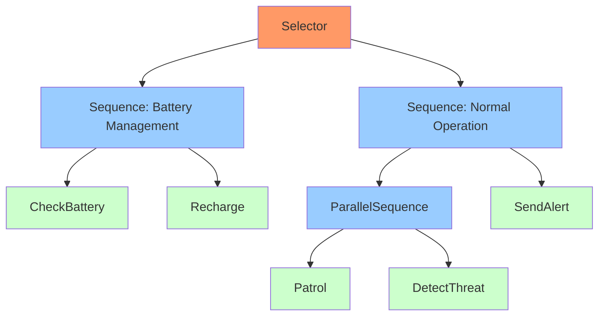

# Security Robot Demo

This demo showcases a simple security robot behavior tree implementation using various node types. The robot patrols an area while monitoring for threats and managing its battery level.

## Overview

The security robot has the following behaviors:
- Battery management (monitoring and recharging)
- Area patrolling
- Threat detection
- Alert system

## Behavior Tree Structure

The behavior tree is defined in `security_robot.yaml` and uses the following node types:
- `Selector`: For main decision making
- `Sequence`: For ordered execution of tasks
- `ParallelSequence`: For concurrent execution of patrol and threat detection
- Custom action nodes for specific behaviors

The complete behavior tree structure can be visualized in the behavior tree diagram:

